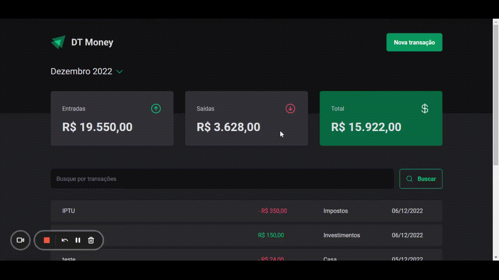

# DT MONEY

## 📋 Table of contents

- [About](#about)
- [Step by step to use the application](#step-by-step-to-use-the-application)
- [Built with](#built-with)
- [Author](#author)

## 📃 About

DT Money is an ideal finance control system for keeping track of your monthly consumption and income. With it, the user can perform the following operations:

- Add a new input or output;
- Filter transactions by description, value, category or date;
- View the sum of entries and exits, and the final balance of the period;
- Filter the transactions in monthly periods, being able to visualize the sum of the entries, exits and balance of each month.



## 🚀 Step by step to use the application

1 - Install the dependencies:

```
  npm install
```

2 - Run the web aplication in development mode:

```
  npm run dev
```

3 - Run the local database:

```
  npm run dev:server
```

## 🔧 Built with

- [React JS](https://pt-br.reactjs.org/)
- [Typescript](https://www.typescriptlang.org/)
- [Styled-components](https://styled-components.com/)
- [Vitest](https://vitest.dev/)
- [React Testing Library](https://testing-library.com/docs/react-testing-library/intro/)

## 🤵 Author

- [LinkedIn](https://www.linkedin.com/in/kevenpacheco/)
# dt-money
